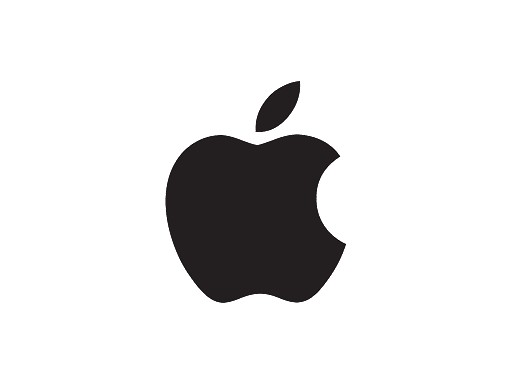

<h2 align="center">APPLE PROJECT </h2>

  
<i>
Apple Inc. is an American multinational technology company that specializes in consumer electronics, computer software, and online services. Apple is the world's largest technology company by revenue and, since January 2021, the world's most valuable company..
</i> 
<a href="https://www.apple.com">www.apple.com</a> 

<h2>APPLE-Clone Project:</h2>

This is a simple clone of webpage apple.com using HTML, CSS. Check out the page at
https://github.com/abbasmurudkar/APPLE_PROJECT

<h2>page_facing_up: How to use:</h2>
<ol>
  <li>Download the ZIP file</li>
  <li>Extraxt from any ZIP Extracter</li>
  <li>Open `index.html` in any Browser</li>
  </ol>

## :camera: Screenshot:

## :octocat: Credits:

- ABBAS MURUDKAR (https://www.linkedin.com/in/abbas-murudkar-0084391ba/)

## :memo: Disclaimer:

**_Note: This Flipkart clone project is just for educational purpose._**

